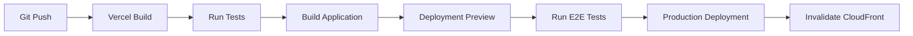

# Clario Career Platform - System Design Document

## 1. Executive Summary

### 1.1 System Overview

Clario is a comprehensive AI-powered career development platform that combines interactive 3D visualization, personalized AI coaching, and real-time mentorship to guide users through their career journey. The system serves students, professionals, and industry mentors through a scalable, cloud-native architecture.

### 1.2 Key Design Principles

- **AI-First Architecture**: Leveraging multiple AI services for personalized experiences
- **Scalable Microservices**: Modular design for independent scaling and deployment
- **Real-time Communication**: WebSocket-based messaging and video calling
- **Global Content Delivery**: CDN-optimized for worldwide performance
- **Security by Design**: End-to-end encryption and compliance-ready architecture

### 1.3 Technology Stack Summary

- **Frontend**: Next.js 16 with React 19, TypeScript, Tailwind CSS
- **Backend**: Node.js APIs, Supabase PostgreSQL, Redis caching
- **AI/ML**: Google Gemini, Groq, Pinecone, LangChain, Vapi AI
- **Cloud/Infra**: Vercel (Hosting), AWS (S3, CloudFront, WAF)
- **Communication**: ZegoCloud, Supabase Realtime
- **Payments**: Razorpay integration

## 2. System Architecture

### 2.1 High-Level Architecture

```
┌─────────────────────────────────────────────────────────────────┐
│                        AWS CloudFront CDN                       │
│                    (Global Content Delivery)                    │
└─────────────────────┬───────────────────────────────────────────┘
                      │
┌─────────────────────┴───────────────────────────────────────────┐
│                        Vercel Hosting                           │
│                     (Next.js Application)                       │
└─────────────────────┬───────────────────────────────────────────┘
                      │
┌─────────────────────┴───────────────────────────────────────────┐
│                    Application Layer                            │
│  ┌─────────────┐  ┌─────────────┐  ┌─────────────┐              │
│  │   Web App   │  │  Mobile App │  │   Admin     │              │
│  │  (Next.js)  │  │  (Future)   │  │  Dashboard  │              │
│  └─────────────┘  └─────────────┘  └─────────────┘              │
└─────────────────────┬───────────────────────────────────────────┘
                      │
┌─────────────────────┴───────────────────────────────────────────┐
│                        Backend & API                            │
│              (Next.js API Routes + Middleware)                  │
└─────────────────────┬───────────────────────────────────────────┘
                      │
┌─────────────────────┴───────────────────────────────────────────┐
│                    Service Layer                                │
│  ┌─────────────┐  ┌─────────────┐  ┌───────────────┐            │
│  │    Auth     │  │     AI      │  │ Communication │            │
│  │  Service    │  │  Services   │  │   Service     │            │
│  └─────────────┘  └─────────────┘  └───────────────┘            │
│  ┌─────────────┐  ┌─────────────┐  ┌─────────────┐              │
│  │   Payment   │  │   Storage   │  │  Analytics  │              │
│  │  Service    │  │  Service    │  │   Service   │              │
│  └─────────────┘  └─────────────┘  └─────────────┘              │
└─────────────────────┬───────────────────────────────────────────┘
                      │
┌─────────────────────┴───────────────────────────────────────────┐
│                     Data Layer                                  │
│  ┌─────────────┐  ┌─────────────┐  ┌─────────────┐              │
│  │  Supabase   │  │   Redis     │  │  Pinecone   │              │
│  │ PostgreSQL  │  │   Cache     │  │  Vector DB  │              │
│  └─────────────┘  └─────────────┘  └─────────────┘              │
│  ┌─────────────┐  ┌─────────────┐                               │
│  │   AWS S3    │  │   AWS WAF   │                               │
│  │  Storage    │  │  Security   │                               │
│  └─────────────┘  └─────────────┘                               │
└─────────────────────────────────────────────────────────────────┘
```

### 2.2 Component Architecture

The system follows a modular, service-oriented architecture with clear separation of concerns:

#### 2.2.1 Frontend Layer

- **Next.js Application**: Server-side rendered React application
- **Component Library**: Reusable UI components (Radix UI, custom components)
- **State Management**: Zustand stores for global state, React Context for local state
- **3D Visualization**: Three.js and React Three Fiber for roadmap rendering

#### 2.2.2 API Layer

- **Next.js API Routes**: RESTful endpoints for all business logic
- **Middleware**: Authentication, rate limiting, request validation
- **Error Handling**: Centralized error management and logging
- **Response Caching**: Redis-based caching for frequently accessed data

#### 2.2.3 Service Layer

- **Authentication Service**: User management, OAuth, session handling
- **AI Service**: LLM orchestration, prompt management, response processing
- **Communication Service**: Real-time messaging, video calling, notifications
- **Payment Service**: Subscription management, billing, transaction processing
- **Storage Service**: File upload, CDN integration, asset management
- **Analytics Service**: User behavior tracking, performance monitoring

#### 2.2.4 Data Layer

- **Primary Database**: Supabase PostgreSQL for relational data
- **Cache Layer**: Redis for session management and performance optimization
- **Vector Database**: Pinecone for AI embeddings and semantic search
- **File Storage**: AWS S3 for assets
- **CDN**: AWS CloudFront for global content delivery
- **Security**: AWS WAF for application protection

## 3. Infrastructure & Hosting Design

### 3.1 AWS S3 Storage Architecture

#### 3.1.1 Bucket Structure

```
clario-production/
├── users/
│   ├── avatars/
│   ├── resumes/
│   ├── portfolios/
│   └── certificates/
├── mentors/
│   ├── profiles/
│   ├── videos/
│   └── documents/
├── content/
│   ├── roadmaps/
│   ├── 3d-assets/
│   ├── course-materials/
│   └── templates/
├── system/
│   ├── backups/
│   ├── logs/
│   └── analytics/
└── static/
    ├── images/
    ├── videos/
    └── documents/
```

#### 3.1.2 S3 Configuration

- **Storage Classes**:
  - Standard for frequently accessed files (user uploads, active content)
  - Standard-IA for infrequently accessed files (archived resumes, old videos)
  - Glacier for long-term archival (backup data, compliance records)
- **Lifecycle Policies**: Automatic transition to cheaper storage classes
- **Versioning**: Enabled for critical user documents and system backups
- **Encryption**: Server-side encryption with AWS KMS for sensitive data
- **Access Control**: IAM policies and bucket policies for secure access

#### 3.1.3 Integration Points

```typescript
// S3 Service Integration
class S3StorageService {
  async uploadUserFile(userId: string, file: File, category: string) {
    const key = `users/${userId}/${category}/${file.name}`;
    return await this.s3Client
      .upload({
        Bucket: "clario-production",
        Key: key,
        Body: file,
        ServerSideEncryption: "aws:kms",
        Metadata: {
          userId,
          uploadedAt: new Date().toISOString(),
          category,
        },
      })
      .promise();
  }

  async generateSignedUrl(key: string, expiresIn: number = 3600) {
    return this.s3Client.getSignedUrl("getObject", {
      Bucket: "clario-production",
      Key: key,
      Expires: expiresIn,
    });
  }
}
```

### 3.2 AWS CloudFront CDN Design

#### 3.2.1 Distribution Configuration

```yaml
CloudFront Distribution:
  Origins:
    - S3 Bucket (clario-production)
    - Vercel Application
    - API Gateway (if used)

  Cache Behaviors:
    - /static/*: Cache for 1 year, compress
    - /api/*: No cache, forward headers
    - /users/avatars/*: Cache for 1 day
    - /content/*: Cache for 1 week
    - Default: Cache for 1 hour

  Security:
    - Origin Access Control (OAC)
    - Custom SSL Certificate
    - Security Headers
    - WAF Integration
```

#### 3.2.2 Performance Optimization

- **Compression**: Gzip/Brotli compression for text-based assets
- **HTTP/2**: Enabled for improved performance
- **Edge Locations**: Global distribution for reduced latency
- **Custom Cache Keys**: Optimized caching based on user context
- **Real-time Logs**: CloudWatch integration for monitoring

#### 3.2.3 Security Features

```typescript
// CloudFront Security Configuration
const securityHeaders = {
  "Strict-Transport-Security": "max-age=31536000; includeSubDomains",
  "X-Content-Type-Options": "nosniff",
  "X-Frame-Options": "DENY",
  "X-XSS-Protection": "1; mode=block",
  "Referrer-Policy": "strict-origin-when-cross-origin",
  "Content-Security-Policy":
    "default-src 'self'; script-src 'self' 'unsafe-inline'",
};
```

### 3.3 Vercel Hosting Design

#### 3.3.1 Application Hosting

```yaml
Vercel Configuration:
  Framework: Next.js
  Deployment: Serverless / Edge
  Node Version: 20.x
  Build Command: next build
  Output Directory: .next

  Environment Variables:
    - NEXT_PUBLIC_SUPABASE_URL
    - NEXT_PUBLIC_SUPABASE_ANON_KEY
    - GEMINI_API_KEY (encrypted)
    - PINECONE_API_KEY (encrypted)
    - AWS_S3_BUCKET (encrypted)

  Custom Domain:
    - www.clarioo.live
    - clarioo.live (redirect)

  SSL Certificate: Managed by Vercel
```

#### 3.3.2 CI/CD Pipeline



#### 3.3.3 Environment Management

- **Development**: Feature branch deployments for testing
- **Staging**: Main branch deployment for QA and integration testing
- **Production**: Tagged releases with manual approval
- **Preview**: Pull request previews for code review

## 4. Database Design

### 4.1 Supabase PostgreSQL Schema

#### 4.1.1 Core Tables

```sql
-- Users table
CREATE TABLE users (
  id UUID PRIMARY KEY DEFAULT gen_random_uuid(),
  email VARCHAR(255) UNIQUE NOT NULL,
  username VARCHAR(100) UNIQUE NOT NULL,
  full_name VARCHAR(255),
  avatar_url TEXT,
  phone VARCHAR(20),
  institution_name VARCHAR(255),
  main_focus VARCHAR(100),
  current_status VARCHAR(50),
  total_credits INTEGER DEFAULT 100,
  remaining_credits INTEGER DEFAULT 100,
  is_pro BOOLEAN DEFAULT FALSE,
  is_verified BOOLEAN DEFAULT FALSE,
  calendar_connected BOOLEAN DEFAULT FALSE,
  latitude DECIMAL(10, 8),
  longitude DECIMAL(11, 8),
  google_refresh_token TEXT,
  created_at TIMESTAMP WITH TIME ZONE DEFAULT NOW(),
  updated_at TIMESTAMP WITH TIME ZONE DEFAULT NOW()
);

-- Mentors table
CREATE TABLE mentors (
  id UUID PRIMARY KEY DEFAULT gen_random_uuid(),
  email VARCHAR(255) UNIQUE NOT NULL,
  full_name VARCHAR(255) NOT NULL,
  phone VARCHAR(20),
  linkedin VARCHAR(255),
  bio TEXT,
  expertise TEXT[] DEFAULT '{}',
  current_position VARCHAR(255),
  availability BOOLEAN DEFAULT TRUE,
  rating DECIMAL(3,2) DEFAULT 0.0,
  avatar_url TEXT,
  video_url TEXT,
  is_verified BOOLEAN DEFAULT FALSE,
  created_at TIMESTAMP WITH TIME ZONE DEFAULT NOW(),
  updated_at TIMESTAMP WITH TIME ZONE DEFAULT NOW()
);

-- User Quiz Data table
CREATE TABLE user_quiz_data (
  id UUID PRIMARY KEY DEFAULT gen_random_uuid(),
  user_id UUID REFERENCES users(id) ON DELETE CASCADE,
  quiz_info JSONB NOT NULL,
  selected_career VARCHAR(255),
  user_current_status VARCHAR(50),
  user_main_focus VARCHAR(100),
  created_at TIMESTAMP WITH TIME ZONE DEFAULT NOW()
);

-- Learning Tracks table
CREATE TABLE learning_tracks (
  id UUID PRIMARY KEY DEFAULT gen_random_uuid(),
  user_id UUID REFERENCES users(id) ON DELETE CASCADE,
  title VARCHAR(255) NOT NULL,
  description TEXT,
  career_path VARCHAR(255),
  difficulty_level VARCHAR(50),
  estimated_duration VARCHAR(100),
  progress_percentage INTEGER DEFAULT 0,
  checkpoints JSONB DEFAULT '[]',
  is_active BOOLEAN DEFAULT TRUE,
  created_at TIMESTAMP WITH TIME ZONE DEFAULT NOW(),
  updated_at TIMESTAMP WITH TIME ZONE DEFAULT NOW()
);

-- Roadmaps table
CREATE TABLE roadmaps (
  id UUID PRIMARY KEY DEFAULT gen_random_uuid(),
  user_id UUID REFERENCES users(id) ON DELETE CASCADE,
  title VARCHAR(255) NOT NULL,
  description TEXT,
  career_field VARCHAR(255),
  timeline VARCHAR(100),
  difficulty VARCHAR(50),
  nodes JSONB DEFAULT '[]',
  edges JSONB DEFAULT '[]',
  is_public BOOLEAN DEFAULT FALSE,
  created_at TIMESTAMP WITH TIME ZONE DEFAULT NOW(),
  updated_at TIMESTAMP WITH TIME ZONE DEFAULT NOW()
);
```

#### 4.1.2 Relationship Tables

```sql
-- Mentor Sessions table
CREATE TABLE mentor_sessions (
  id UUID PRIMARY KEY DEFAULT gen_random_uuid(),
  mentor_id UUID REFERENCES mentors(id) ON DELETE CASCADE,
  user_id UUID REFERENCES users(id) ON DELETE CASCADE,
  session_type VARCHAR(50) NOT NULL,
  scheduled_at TIMESTAMP WITH TIME ZONE NOT NULL,
  duration_minutes INTEGER DEFAULT 60,
  status VARCHAR(50) DEFAULT 'pending',
  meeting_url TEXT,
  notes TEXT,
  rating INTEGER CHECK (rating >= 1 AND rating <= 5),
  feedback TEXT,
  amount_paid DECIMAL(10,2),
  created_at TIMESTAMP WITH TIME ZONE DEFAULT NOW(),
  updated_at TIMESTAMP WITH TIME ZONE DEFAULT NOW()
);

-- Job Tracker table
CREATE TABLE job_applications (
  id UUID PRIMARY KEY DEFAULT gen_random_uuid(),
  user_id UUID REFERENCES users(id) ON DELETE CASCADE,
  company_name VARCHAR(255) NOT NULL,
  position_title VARCHAR(255) NOT NULL,
  job_url TEXT,
  application_date DATE,
  status VARCHAR(50) DEFAULT 'saved',
  salary_range VARCHAR(100),
  location VARCHAR(255),
  notes TEXT,
  interview_dates JSONB DEFAULT '[]',
  created_at TIMESTAMP WITH TIME ZONE DEFAULT NOW(),
  updated_at TIMESTAMP WITH TIME ZONE DEFAULT NOW()
);

-- Messages table
CREATE TABLE messages (
  id UUID PRIMARY KEY DEFAULT gen_random_uuid(),
  sender_id UUID NOT NULL,
  receiver_id UUID NOT NULL,
  message_type VARCHAR(50) DEFAULT 'text',
  content TEXT NOT NULL,
  attachments JSONB DEFAULT '[]',
  is_read BOOLEAN DEFAULT FALSE,
  created_at TIMESTAMP WITH TIME ZONE DEFAULT NOW()
);
```

### 4.2 Redis Cache Design

#### 4.2.1 Cache Structure

```typescript
// Cache Key Patterns
const CACHE_KEYS = {
  USER_PROFILE: "user:profile:{userId}",
  MENTOR_LIST: "mentors:list:{focus}:{page}",
  QUIZ_DATA: "quiz:data:{userId}",
  ROADMAP_DATA: "roadmap:{roadmapId}",
  SESSION_DATA: "session:{sessionId}",
  AI_RESPONSE: "ai:response:{hash}",
  JOB_LISTINGS: "jobs:{query}:{location}",
  COLLEGE_DATA: "colleges:{filters}",
};

// Cache TTL Configuration
const CACHE_TTL = {
  USER_PROFILE: 3600, // 1 hour
  MENTOR_LIST: 600, // 10 minutes
  QUIZ_DATA: 1800, // 30 minutes
  AI_RESPONSE: 7200, // 2 hours
  JOB_LISTINGS: 1800, // 30 minutes
  SESSION_DATA: 300, // 5 minutes
};
```

#### 4.2.2 Caching Strategy

```typescript
class CacheService {
  async get<T>(key: string): Promise<T | null> {
    const cached = await this.redis.get(key);
    return cached ? JSON.parse(cached) : null;
  }

  async set<T>(key: string, value: T, ttl?: number): Promise<void> {
    const serialized = JSON.stringify(value);
    if (ttl) {
      await this.redis.setex(key, ttl, serialized);
    } else {
      await this.redis.set(key, serialized);
    }
  }

  async invalidatePattern(pattern: string): Promise<void> {
    const keys = await this.redis.keys(pattern);
    if (keys.length > 0) {
      await this.redis.del(...keys);
    }
  }
}
```

### 4.3 Pinecone Vector Database Design

#### 4.3.1 Index Configuration

```typescript
// Pinecone Index Setup
const PINECONE_CONFIG = {
  indexName: "clario-knowledge",
  dimension: 1536, // OpenAI embedding dimension
  metric: "cosine",
  pods: 1,
  replicas: 1,
  podType: "p1.x1",
};

// Namespace Structure
const NAMESPACES = {
  CAREER_PATHS: "career-paths",
  JOB_DESCRIPTIONS: "job-descriptions",
  SKILLS: "skills",
  COURSES: "courses",
  INTERVIEW_QUESTIONS: "interview-questions",
  INDUSTRY_INSIGHTS: "industry-insights",
};
```

#### 4.3.2 Embedding Strategy

```typescript
class VectorService {
  async upsertCareerData(careerData: CareerDocument[]) {
    const vectors = await Promise.all(
      careerData.map(async (doc) => ({
        id: doc.id,
        values: await this.generateEmbedding(doc.content),
        metadata: {
          title: doc.title,
          category: doc.category,
          skills: doc.skills,
          experience_level: doc.experienceLevel,
          industry: doc.industry,
        },
      })),
    );

    await this.pinecone.upsert({
      upsertRequest: {
        vectors,
        namespace: NAMESPACES.CAREER_PATHS,
      },
    });
  }

  async searchSimilarCareers(query: string, topK: number = 10) {
    const queryEmbedding = await this.generateEmbedding(query);

    return await this.pinecone.query({
      queryRequest: {
        vector: queryEmbedding,
        topK,
        includeMetadata: true,
        namespace: NAMESPACES.CAREER_PATHS,
      },
    });
  }
}
```

## 5. AI Services Architecture

### 5.1 LLM Integration Design

#### 5.1.1 Multi-Model Strategy

```typescript
// AI Service Configuration
const AI_MODELS = {
  CONVERSATION: {
    provider: "google",
    model: "gemini-pro",
    temperature: 0.7,
    maxTokens: 2048,
  },
  ROADMAP_GENERATION: {
    provider: "groq",
    model: "llama-3-70b-8192",
    temperature: 0.3,
    maxTokens: 4096,
  },
  QUESTION_GENERATION: {
    provider: "google",
    model: "gemini-pro",
    temperature: 0.5,
    maxTokens: 1024,
  },
};

class AIOrchestrator {
  async processCareerQuery(query: string, context: UserContext) {
    // 1. Retrieve relevant context from Pinecone
    const relevantDocs = await this.vectorService.searchSimilarCareers(query);

    // 2. Search web for current information
    const webResults = await this.tavilyService.search(query);

    // 3. Generate response using Gemini
    const response = await this.geminiService.generateResponse({
      query,
      context: relevantDocs,
      webData: webResults,
      userProfile: context.user,
    });

    return response;
  }
}
```

#### 5.1.2 Prompt Engineering

```typescript
const PROMPTS = {
  CAREER_ADVISOR: `
    You are an expert career advisor helping users make informed career decisions.
    
    User Profile:
    - Current Status: {currentStatus}
    - Main Focus: {mainFocus}
    - Experience Level: {experienceLevel}
    
    Context Information:
    {contextDocs}
    
    Current Market Data:
    {webResults}
    
    Provide personalized, actionable career advice based on the user's profile and current market conditions.
  `,

  ROADMAP_GENERATOR: `
    Generate a detailed career roadmap for {careerPath} with the following specifications:
    - Timeline: {timeline}
    - Experience Level: {level}
    - Learning Style: {learningStyle}
    
    Include specific milestones, skills to develop, and resources for each stage.
    Format as JSON with nodes and edges for 3D visualization.
  `,
};
```

### 5.2 Voice AI Integration

#### 5.2.1 Vapi AI Configuration

```typescript
class VoiceInterviewService {
  async createInterviewSession(userId: string, careerPath: string) {
    const questions = await this.generateInterviewQuestions(careerPath);

    const vapiConfig = {
      model: {
        provider: "openai",
        model: "gpt-4",
        temperature: 0.3,
      },
      voice: {
        provider: "elevenlabs",
        voiceId: "professional-interviewer",
      },
      firstMessage: `Hello! I'm your AI interviewer. Today we'll be conducting a ${careerPath} interview. Are you ready to begin?`,
      systemMessage: this.buildInterviewPrompt(questions),
      endCallFunctionEnabled: true,
      recordingEnabled: true,
    };

    return await this.vapiClient.createCall(vapiConfig);
  }

  private buildInterviewPrompt(questions: InterviewQuestion[]) {
    return `
      You are conducting a professional job interview for a ${questions[0].category} position.
      
      Interview Questions:
      ${questions.map((q, i) => `${i + 1}. ${q.question}`).join("\n")}
      
      Guidelines:
      - Ask one question at a time
      - Wait for complete answers before proceeding
      - Provide encouraging feedback
      - Take notes on responses for final evaluation
      - End with next steps information
    `;
  }
}
```

## 6. Real-time Communication Design

### 6.1 ZegoCloud Video Integration

#### 6.1.1 Video Call Architecture

```typescript
class VideoCallService {
  async initializeMentorSession(
    sessionId: string,
    participants: Participant[],
  ) {
    const zegoConfig = {
      appID: process.env.ZEGO_APP_ID,
      serverSecret: process.env.ZEGO_SERVER_SECRET,
      roomID: `mentor-session-${sessionId}`,
      userID: participants[0].id,
      userName: participants[0].name,
      token: this.generateZegoToken(participants[0].id),
    };

    // Initialize ZegoCloud SDK
    const zg = new ZegoExpressEngine(
      zegoConfig.appID,
      "wss://webliveroom-api.zego.im/ws",
    );

    // Login to room
    await zg.loginRoom(
      zegoConfig.roomID,
      {
        userID: zegoConfig.userID,
        userName: zegoConfig.userName,
      },
      zegoConfig.token,
    );

    return {
      roomID: zegoConfig.roomID,
      token: zegoConfig.token,
      streamID: `stream-${sessionId}`,
    };
  }

  private generateZegoToken(userID: string): string {
    const payload = {
      iss: "zego",
      exp: Math.floor(Date.now() / 1000) + 3600, // 1 hour expiry
      aud: "zego",
      data: {
        room_id: `mentor-session-${userID}`,
        user_id: userID,
        privilege: {
          1: 1, // Login room
          2: 1, // Publish stream
        },
      },
    };

    return jwt.sign(payload, process.env.ZEGO_SERVER_SECRET);
  }
}
```

### 6.2 Supabase Realtime Messaging

#### 6.2.1 Real-time Subscriptions

```typescript
class RealtimeService {
  setupMessageSubscription(
    userId: string,
    callback: (message: Message) => void,
  ) {
    return this.supabase
      .channel(`messages:${userId}`)
      .on(
        "postgres_changes",
        {
          event: "INSERT",
          schema: "public",
          table: "messages",
          filter: `receiver_id=eq.${userId}`,
        },
        callback,
      )
      .subscribe();
  }

  setupSessionUpdates(
    sessionId: string,
    callback: (session: MentorSession) => void,
  ) {
    return this.supabase
      .channel(`session:${sessionId}`)
      .on(
        "postgres_changes",
        {
          event: "UPDATE",
          schema: "public",
          table: "mentor_sessions",
          filter: `id=eq.${sessionId}`,
        },
        callback,
      )
      .subscribe();
  }

  async sendMessage(senderId: string, receiverId: string, content: string) {
    const { data, error } = await this.supabase
      .from("messages")
      .insert({
        sender_id: senderId,
        receiver_id: receiverId,
        content,
        message_type: "text",
      })
      .select()
      .single();

    if (error) throw error;

    // Trigger real-time notification
    await this.supabase.channel(`notifications:${receiverId}`).send({
      type: "broadcast",
      event: "new_message",
      payload: data,
    });

    return data;
  }
}
```

## 7. Security Architecture

### 7.1 Authentication & Authorization

#### 7.1.1 Supabase Auth Integration

```typescript
class AuthService {
  async signInWithOAuth(
    provider: "google" | "discord" | "slack",
    role: "user" | "mentor",
  ) {
    const { data, error } = await this.supabase.auth.signInWithOAuth({
      provider,
      options: {
        redirectTo: `${process.env.NEXT_PUBLIC_SITE_URL}/auth/callback`,
        queryParams: { role },
        scopes:
          provider === "google" ? "email profile calendar" : "email profile",
      },
    });

    return { data, error };
  }

  async createUserProfile(user: User, role: string, additionalData: any) {
    const table = role === "mentor" ? "mentors" : "users";

    const { data, error } = await this.supabase.from(table).insert({
      id: user.id,
      email: user.email,
      full_name: user.user_metadata.full_name,
      avatar_url: user.user_metadata.avatar_url,
      ...additionalData,
    });

    return { data, error };
  }

  async getSession() {
    const {
      data: { session },
      error,
    } = await this.supabase.auth.getSession();
    return { session, error };
  }
}
```

#### 7.1.2 Role-Based Access Control

```typescript
// Middleware for API route protection
export function withAuth(handler: NextApiHandler, allowedRoles: string[] = []) {
  return async (req: NextApiRequest, res: NextApiResponse) => {
    try {
      const token = req.headers.authorization?.replace("Bearer ", "");
      if (!token) {
        return res.status(401).json({ error: "No token provided" });
      }

      const {
        data: { user },
        error,
      } = await supabase.auth.getUser(token);
      if (error || !user) {
        return res.status(401).json({ error: "Invalid token" });
      }

      const userRole = user.user_metadata?.role || "user";
      if (allowedRoles.length > 0 && !allowedRoles.includes(userRole)) {
        return res.status(403).json({ error: "Insufficient permissions" });
      }

      req.user = user;
      return handler(req, res);
    } catch (error) {
      return res.status(500).json({ error: "Authentication error" });
    }
  };
}

// Usage in API routes
export default withAuth(
  async (req, res) => {
    // Protected route logic
  },
  ["user", "mentor"],
);
```

### 7.2 Data Protection

#### 7.2.1 Encryption Strategy

```typescript
class EncryptionService {
  private readonly algorithm = "aes-256-gcm";
  private readonly keyLength = 32;

  encrypt(text: string, key: string): EncryptedData {
    const iv = crypto.randomBytes(16);
    const cipher = crypto.createCipher(this.algorithm, key);
    cipher.setAAD(Buffer.from("clario-platform"));

    let encrypted = cipher.update(text, "utf8", "hex");
    encrypted += cipher.final("hex");

    const authTag = cipher.getAuthTag();

    return {
      encrypted,
      iv: iv.toString("hex"),
      authTag: authTag.toString("hex"),
    };
  }

  decrypt(encryptedData: EncryptedData, key: string): string {
    const decipher = crypto.createDecipher(this.algorithm, key);
    decipher.setAAD(Buffer.from("clario-platform"));
    decipher.setAuthTag(Buffer.from(encryptedData.authTag, "hex"));

    let decrypted = decipher.update(encryptedData.encrypted, "hex", "utf8");
    decrypted += decipher.final("utf8");

    return decrypted;
  }
}
```

#### 7.2.2 Input Validation & Sanitization

```typescript
import { z } from "zod";

// Validation schemas
const UserProfileSchema = z.object({
  full_name: z.string().min(2).max(100),
  email: z.string().email(),
  phone: z
    .string()
    .regex(/^\+?[\d\s-()]+$/)
    .optional(),
  institution_name: z.string().max(255).optional(),
  main_focus: z.string().max(100).optional(),
});

const MessageSchema = z.object({
  receiver_id: z.string().uuid(),
  content: z.string().min(1).max(5000),
  message_type: z.enum(["text", "image", "file", "video"]),
});

// Validation middleware
export function validateRequest(schema: z.ZodSchema) {
  return (req: NextApiRequest, res: NextApiResponse, next: NextFunction) => {
    try {
      const validated = schema.parse(req.body);
      req.body = validated;
      next();
    } catch (error) {
      if (error instanceof z.ZodError) {
        return res.status(400).json({
          error: "Validation failed",
          details: error.errors,
        });
      }
      return res.status(500).json({ error: "Internal server error" });
    }
  };
}
```

## 8. Performance Optimization

### 8.1 Caching Strategy

#### 8.1.1 Multi-Level Caching

```typescript
class CacheManager {
  private readonly levels = {
    L1: "memory", // In-memory cache (fastest)
    L2: "redis", // Redis cache (fast)
    L3: "database", // Database cache (slowest)
  };

  async get<T>(key: string): Promise<T | null> {
    // L1: Check memory cache
    let result = this.memoryCache.get<T>(key);
    if (result) return result;

    // L2: Check Redis cache
    result = await this.redisCache.get<T>(key);
    if (result) {
      this.memoryCache.set(key, result, 300); // 5 min TTL
      return result;
    }

    // L3: Check database
    result = await this.databaseCache.get<T>(key);
    if (result) {
      await this.redisCache.set(key, result, 1800); // 30 min TTL
      this.memoryCache.set(key, result, 300);
      return result;
    }

    return null;
  }

  async set<T>(key: string, value: T, ttl: number): Promise<void> {
    // Set in all cache levels
    this.memoryCache.set(key, value, Math.min(ttl, 300));
    await this.redisCache.set(key, value, ttl);
    await this.databaseCache.set(key, value, ttl);
  }
}
```

#### 8.1.2 Query Optimization

```typescript
// Optimized database queries with proper indexing
class OptimizedQueries {
  async getMentorsByExpertise(expertise: string[], limit: number = 10) {
    return await this.supabase
      .from("mentors")
      .select(
        `
        id, full_name, avatar_url, current_position, rating,
        expertise, availability, bio
      `,
      )
      .overlaps("expertise", expertise)
      .eq("is_verified", true)
      .eq("availability", true)
      .gte("rating", 4.0)
      .order("rating", { ascending: false })
      .limit(limit);
  }

  async getUserLearningProgress(userId: string) {
    return await this.supabase
      .from("learning_tracks")
      .select(
        `
        id, title, progress_percentage, estimated_duration,
        checkpoints, created_at
      `,
      )
      .eq("user_id", userId)
      .eq("is_active", true)
      .order("created_at", { ascending: false });
  }
}
```

### 8.2 Frontend Optimization

#### 8.2.1 Code Splitting & Lazy Loading

```typescript
// Dynamic imports for code splitting
const CareerRoadmap = dynamic(() => import('@/components/CareerRoadmap'), {
  loading: () => <RoadmapSkeleton />,
  ssr: false // Client-side only for 3D components
});

const VideoCall = dynamic(() => import('@/components/VideoCall'), {
  loading: () => <VideoCallSkeleton />
});

// Route-based code splitting
const routes = [
  {
    path: '/home/ai-tools/roadmap-maker',
    component: lazy(() => import('@/pages/RoadmapMaker'))
  },
  {
    path: '/home/mentor-connect',
    component: lazy(() => import('@/pages/MentorConnect'))
  }
];
```

#### 8.2.2 Image Optimization

```typescript
// Next.js Image optimization with multiple sources
const OptimizedImage = ({ src, alt, ...props }) => (
  <Image
    src={src}
    alt={alt}
    placeholder="blur"
    blurDataURL="data:image/jpeg;base64,/9j/4AAQSkZJRgABAQAAAQ..."
    sizes="(max-width: 768px) 100vw, (max-width: 1200px) 50vw, 33vw"
    quality={85}
    {...props}
  />
);

// ImageKit integration for advanced optimization
const ImageKitProvider = ({ children }) => (
  <IKContext
    publicKey={process.env.NEXT_PUBLIC_IMAGEKIT_PUBLIC_KEY}
    urlEndpoint="https://ik.imagekit.io/clario"
    transformationPosition="path"
  >
    {children}
  </IKContext>
);
```

## 9. Monitoring & Analytics

### 9.1 Application Monitoring

#### 9.1.1 Performance Monitoring

```typescript
class PerformanceMonitor {
  async trackAPIPerformance(
    endpoint: string,
    duration: number,
    status: number,
  ) {
    const metrics = {
      endpoint,
      duration,
      status,
      timestamp: new Date().toISOString(),
      memory_usage: process.memoryUsage(),
      cpu_usage: process.cpuUsage(),
    };

    // Send to monitoring service
    await this.sendMetrics("api_performance", metrics);
  }

  async trackUserAction(userId: string, action: string, metadata: any) {
    const event = {
      user_id: userId,
      action,
      metadata,
      timestamp: new Date().toISOString(),
      session_id: this.getSessionId(),
      user_agent: this.getUserAgent(),
    };

    await this.sendMetrics("user_actions", event);
  }

  private async sendMetrics(type: string, data: any) {
    // Send to analytics service (e.g., Mixpanel, Amplitude)
    await fetch("/api/analytics", {
      method: "POST",
      headers: { "Content-Type": "application/json" },
      body: JSON.stringify({ type, data }),
    });
  }
}
```

#### 9.1.2 Error Tracking

```typescript
class ErrorTracker {
  captureException(error: Error, context?: any) {
    const errorData = {
      message: error.message,
      stack: error.stack,
      timestamp: new Date().toISOString(),
      context,
      user_id: this.getCurrentUserId(),
      url: window.location.href,
      user_agent: navigator.userAgent,
    };

    // Send to error tracking service
    this.sendError(errorData);
  }

  captureAPIError(endpoint: string, status: number, response: any) {
    const errorData = {
      type: "api_error",
      endpoint,
      status,
      response,
      timestamp: new Date().toISOString(),
    };

    this.sendError(errorData);
  }

  private async sendError(errorData: any) {
    try {
      await fetch("/api/errors", {
        method: "POST",
        headers: { "Content-Type": "application/json" },
        body: JSON.stringify(errorData),
      });
    } catch (e) {
      console.error("Failed to send error report:", e);
    }
  }
}
```

### 9.2 Business Analytics

#### 9.2.1 User Behavior Tracking

```typescript
class AnalyticsService {
  trackCareerAssessment(userId: string, results: AssessmentResults) {
    this.track("career_assessment_completed", {
      user_id: userId,
      selected_career: results.selectedCareer,
      confidence_score: results.confidenceScore,
      assessment_duration: results.duration,
      question_count: results.questionCount,
    });
  }

  trackMentorSession(sessionData: MentorSessionData) {
    this.track("mentor_session_completed", {
      session_id: sessionData.id,
      mentor_id: sessionData.mentorId,
      user_id: sessionData.userId,
      duration: sessionData.duration,
      rating: sessionData.rating,
      session_type: sessionData.type,
    });
  }

  trackRoadmapGeneration(userId: string, roadmapData: RoadmapData) {
    this.track("roadmap_generated", {
      user_id: userId,
      career_path: roadmapData.careerPath,
      timeline: roadmapData.timeline,
      difficulty: roadmapData.difficulty,
      node_count: roadmapData.nodes.length,
    });
  }

  private track(event: string, properties: any) {
    // Send to analytics platform
    if (typeof window !== "undefined") {
      // Client-side tracking
      gtag("event", event, properties);
      mixpanel.track(event, properties);
    } else {
      // Server-side tracking
      this.serverAnalytics.track(event, properties);
    }
  }
}
```

## 10. Deployment & DevOps

### 10.1 CI/CD Pipeline

#### 10.1.1 GitHub Actions Workflow

```yaml
name: Deploy to AWS Amplify

on:
  push:
    branches: [main, develop]
  pull_request:
    branches: [main]

jobs:
  test:
    runs-on: ubuntu-latest
    steps:
      - uses: actions/checkout@v3
      - uses: actions/setup-node@v3
        with:
          node-version: "18"
          cache: "npm"

      - run: npm ci
      - run: npm run lint
      - run: npm run type-check
      - run: npm run test
      - run: npm run test:e2e

  build-and-deploy:
    needs: test
    runs-on: ubuntu-latest
    if: github.ref == 'refs/heads/main'

    steps:
      - uses: actions/checkout@v3

      - name: Configure AWS credentials
        uses: aws-actions/configure-aws-credentials@v2
        with:
          aws-access-key-id: ${{ secrets.AWS_ACCESS_KEY_ID }}
          aws-secret-access-key: ${{ secrets.AWS_SECRET_ACCESS_KEY }}
          aws-region: us-east-1

      - name: Deploy to Amplify
        run: |
          aws amplify start-job \
            --app-id ${{ secrets.AMPLIFY_APP_ID }} \
            --branch-name main \
            --job-type RELEASE

      - name: Invalidate CloudFront
        run: |
          aws cloudfront create-invalidation \
            --distribution-id ${{ secrets.CLOUDFRONT_DISTRIBUTION_ID }} \
            --paths "/*"
```

#### 10.1.2 Environment Configuration

```typescript
// Environment-specific configurations
const config = {
  development: {
    api: {
      baseUrl: "http://localhost:3000/api",
      timeout: 10000,
    },
    supabase: {
      url: process.env.NEXT_PUBLIC_SUPABASE_URL,
      anonKey: process.env.NEXT_PUBLIC_SUPABASE_ANON_KEY,
    },
    aws: {
      region: "us-east-1",
      s3Bucket: "clario-dev-assets",
    },
  },

  production: {
    api: {
      baseUrl: "https://api.clario.ai",
      timeout: 5000,
    },
    supabase: {
      url: process.env.NEXT_PUBLIC_SUPABASE_URL,
      anonKey: process.env.NEXT_PUBLIC_SUPABASE_ANON_KEY,
    },
    aws: {
      region: "us-east-1",
      s3Bucket: "clario-production-assets",
    },
  },
};
```

### 10.2 Infrastructure as Code

#### 10.2.1 AWS CDK Stack

```typescript
import * as cdk from "aws-cdk-lib";
import * as s3 from "aws-cdk-lib/aws-s3";
import * as cloudfront from "aws-cdk-lib/aws-cloudfront";
import * as amplify from "aws-cdk-lib/aws-amplify";

export class ClarioInfrastructureStack extends cdk.Stack {
  constructor(scope: Construct, id: string, props?: cdk.StackProps) {
    super(scope, id, props);

    // S3 Bucket for assets
    const assetsBucket = new s3.Bucket(this, "ClarioAssetsBucket", {
      bucketName: "clario-production-assets",
      versioned: true,
      encryption: s3.BucketEncryption.S3_MANAGED,
      lifecycleRules: [
        {
          id: "transition-to-ia",
          transitions: [
            {
              storageClass: s3.StorageClass.INFREQUENT_ACCESS,
              transitionAfter: cdk.Duration.days(30),
            },
          ],
        },
      ],
      cors: [
        {
          allowedMethods: [s3.HttpMethods.GET, s3.HttpMethods.POST],
          allowedOrigins: ["https://clario.ai", "https://www.clario.ai"],
          allowedHeaders: ["*"],
        },
      ],
    });

    // CloudFront Distribution
    const distribution = new cloudfront.Distribution(
      this,
      "ClarioDistribution",
      {
        defaultBehavior: {
          origin: new cloudfront.S3Origin(assetsBucket),
          viewerProtocolPolicy:
            cloudfront.ViewerProtocolPolicy.REDIRECT_TO_HTTPS,
          cachePolicy: cloudfront.CachePolicy.CACHING_OPTIMIZED,
        },
        additionalBehaviors: {
          "/api/*": {
            origin: new cloudfront.HttpOrigin("api.clario.ai"),
            cachePolicy: cloudfront.CachePolicy.CACHING_DISABLED,
            viewerProtocolPolicy: cloudfront.ViewerProtocolPolicy.HTTPS_ONLY,
          },
        },
        domainNames: ["clario.ai", "www.clario.ai"],
        certificate: acm.Certificate.fromCertificateArn(
          this,
          "Certificate",
          "arn:aws:acm:us-east-1:123456789:certificate/...",
        ),
      },
    );

    // Amplify App
    const amplifyApp = new amplify.App(this, "ClarioApp", {
      sourceCodeProvider: new amplify.GitHubSourceCodeProvider({
        owner: "clario-team",
        repository: "clario-platform",
        oauthToken: cdk.SecretValue.secretsManager("github-token"),
      }),
      buildSpec: amplify.BuildSpec.fromObjectToYaml({
        version: "1.0",
        frontend: {
          phases: {
            preBuild: {
              commands: ["npm ci"],
            },
            build: {
              commands: ["npm run build"],
            },
          },
          artifacts: {
            baseDirectory: ".next",
            files: ["**/*"],
          },
          cache: {
            paths: ["node_modules/**/*"],
          },
        },
      }),
    });

    // Environment variables
    amplifyApp.addEnvironment(
      "NEXT_PUBLIC_SUPABASE_URL",
      process.env.SUPABASE_URL!,
    );
    amplifyApp.addEnvironment(
      "NEXT_PUBLIC_SUPABASE_ANON_KEY",
      process.env.SUPABASE_ANON_KEY!,
    );

    // Production branch
    const mainBranch = amplifyApp.addBranch("main", {
      autoBuild: true,
      stage: "PRODUCTION",
    });

    // Development branch
    amplifyApp.addBranch("develop", {
      autoBuild: true,
      stage: "DEVELOPMENT",
    });
  }
}
```

## 11. Scalability Considerations

### 11.1 Horizontal Scaling

#### 11.1.1 Database Scaling

```typescript
// Read replica configuration for Supabase
const databaseConfig = {
  primary: {
    host: "primary.supabase.co",
    role: "write",
  },
  replicas: [
    {
      host: "replica-1.supabase.co",
      role: "read",
      region: "us-west-2",
    },
    {
      host: "replica-2.supabase.co",
      role: "read",
      region: "eu-west-1",
    },
  ],
};

class DatabaseRouter {
  async query(
    sql: string,
    params: any[],
    operation: "read" | "write" = "read",
  ) {
    const client =
      operation === "write"
        ? this.getPrimaryClient()
        : this.getReadReplicaClient();

    return await client.query(sql, params);
  }

  private getReadReplicaClient() {
    // Load balance between read replicas
    const replica = this.selectReplica();
    return this.createClient(replica.host);
  }

  private selectReplica() {
    // Simple round-robin selection
    const replicas = databaseConfig.replicas;
    const index = this.currentReplicaIndex % replicas.length;
    this.currentReplicaIndex++;
    return replicas[index];
  }
}
```

#### 11.1.2 API Scaling

```typescript
// Rate limiting and load balancing
class RateLimiter {
  private readonly limits = new Map<string, number>();

  async checkLimit(userId: string, endpoint: string): Promise<boolean> {
    const key = `${userId}:${endpoint}`;
    const current = this.limits.get(key) || 0;

    const limit = this.getEndpointLimit(endpoint);

    if (current >= limit) {
      return false;
    }

    this.limits.set(key, current + 1);

    // Reset counter after time window
    setTimeout(() => {
      this.limits.delete(key);
    }, 60000); // 1 minute window

    return true;
  }

  private getEndpointLimit(endpoint: string): number {
    const limits = {
      "/api/ai/": 10, // 10 AI requests per minute
      "/api/upload": 5, // 5 uploads per minute
      "/api/messages": 100, // 100 messages per minute
      default: 60, // 60 requests per minute
    };

    for (const [pattern, limit] of Object.entries(limits)) {
      if (endpoint.includes(pattern)) {
        return limit;
      }
    }

    return limits.default;
  }
}
```

### 11.2 Performance Optimization

#### 11.2.1 Connection Pooling

```typescript
// Database connection pooling
class ConnectionPool {
  private pool: Pool;

  constructor() {
    this.pool = new Pool({
      connectionString: process.env.DATABASE_URL,
      max: 20, // Maximum connections
      min: 5, // Minimum connections
      idleTimeoutMillis: 30000, // Close idle connections after 30s
      connectionTimeoutMillis: 2000, // Timeout after 2s
      maxUses: 7500, // Close connection after 7500 uses
    });
  }

  async query(text: string, params?: any[]) {
    const client = await this.pool.connect();
    try {
      const result = await client.query(text, params);
      return result;
    } finally {
      client.release();
    }
  }

  async getPoolStatus() {
    return {
      totalCount: this.pool.totalCount,
      idleCount: this.pool.idleCount,
      waitingCount: this.pool.waitingCount,
    };
  }
}
```

#### 11.2.2 Background Job Processing

```typescript
// Queue system for background tasks
class JobQueue {
  private queue: Queue;

  constructor() {
    this.queue = new Queue("clario-jobs", {
      redis: {
        host: process.env.REDIS_HOST,
        port: parseInt(process.env.REDIS_PORT || "6379"),
      },
    });

    this.setupProcessors();
  }

  private setupProcessors() {
    // AI processing jobs
    this.queue.process("generate-roadmap", 5, async (job) => {
      const { userId, careerPath, timeline } = job.data;
      return await this.generateRoadmap(userId, careerPath, timeline);
    });

    // Email jobs
    this.queue.process("send-email", 10, async (job) => {
      const { to, subject, template, data } = job.data;
      return await this.sendEmail(to, subject, template, data);
    });

    // Analytics jobs
    this.queue.process("process-analytics", 3, async (job) => {
      const { events } = job.data;
      return await this.processAnalyticsEvents(events);
    });
  }

  async addJob(type: string, data: any, options?: any) {
    return await this.queue.add(type, data, {
      attempts: 3,
      backoff: "exponential",
      delay: 0,
      ...options,
    });
  }
}
```

## 12. Future Enhancements

### 12.1 Mobile Application

#### 12.1.1 React Native Architecture

```typescript
// Shared business logic between web and mobile
class SharedServices {
  static createAPIClient(baseURL: string) {
    return axios.create({
      baseURL,
      timeout: 10000,
      headers: {
        'Content-Type': 'application/json'
      }
    });
  }

  static createAuthService(supabaseConfig: SupabaseConfig) {
    return new AuthService(supabaseConfig);
  }

  static createAIService(apiKeys: AIApiKeys) {
    return new AIService(apiKeys);
  }
}

// Platform-specific implementations
// Mobile: React Native
const MobileApp = () => {
  const services = useMemo(() => ({
    api: SharedServices.createAPIClient('https://api.clario.ai'),
    auth: SharedServices.createAuthService(supabaseConfig),
    ai: SharedServices.createAIService(aiApiKeys)
  }), []);

  return (
    <NavigationContainer>
      <ServiceProvider services={services}>
        <AppNavigator />
      </ServiceProvider>
    </NavigationContainer>
  );
};
```

### 12.2 Advanced AI Features

#### 12.2.1 Predictive Analytics

```typescript
class PredictiveAnalytics {
  async predictCareerSuccess(userProfile: UserProfile, careerPath: string) {
    const features = this.extractFeatures(userProfile);
    const marketData = await this.getMarketData(careerPath);

    const prediction = await this.mlModel.predict({
      features,
      marketData,
      careerPath,
    });

    return {
      successProbability: prediction.probability,
      keyFactors: prediction.factors,
      recommendations: prediction.recommendations,
      timeToSuccess: prediction.estimatedTime,
    };
  }

  private extractFeatures(profile: UserProfile) {
    return {
      education_level: this.encodeEducation(profile.education),
      skills_count: profile.skills.length,
      experience_years: profile.experienceYears,
      location_tier: this.encodeLocation(profile.location),
      network_size: profile.connections?.length || 0,
      learning_velocity: this.calculateLearningVelocity(profile),
    };
  }
}
```

### 12.3 Enterprise Features

#### 12.3.1 Multi-Tenant Architecture

```typescript
class TenantService {
  async createTenant(organizationData: OrganizationData) {
    // Create isolated database schema
    const schema = `tenant_${organizationData.id}`;
    await this.createTenantSchema(schema);

    // Set up tenant-specific configurations
    const tenantConfig = {
      id: organizationData.id,
      name: organizationData.name,
      schema,
      features: organizationData.features,
      limits: organizationData.limits,
      customization: organizationData.branding,
    };

    return await this.saveTenantConfig(tenantConfig);
  }

  async getTenantContext(request: Request): Promise<TenantContext> {
    const subdomain = this.extractSubdomain(request.headers.host);
    const tenant = await this.findTenantBySubdomain(subdomain);

    return {
      id: tenant.id,
      schema: tenant.schema,
      features: tenant.features,
      limits: tenant.limits,
      customization: tenant.customization,
    };
  }
}
```

This comprehensive design document provides a detailed technical blueprint for the Clario Career Platform, incorporating AWS services for scalable cloud infrastructure, robust security measures, and future-ready architecture patterns. The design emphasizes modularity, scalability, and maintainability while leveraging cutting-edge AI technologies for personalized career guidance.
